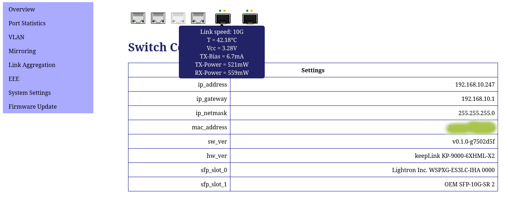

# RTLPlayground
A Playground for Firmware development for advanced user of RTL8372/RTL8373 based 2.5GBit Switches.

For each hardware configuration of these devices, there is usually a managed and an
umanaged version sold, with mostly identical hardware. The aim is to provide management
features also for unmanaged devices with additional features such as Management VLAN,
dhcp servers, multi-language support, IPv6 and TLS-encrypted web-pages. At present, however
only the following features are provided:
- A modern web-interface with mouse-over to display further information
- A serial console interface to configure all features
- IGMP to configure Multicast streaming
- Port configuration showing detailed informtion about own and Link-partner advertised
  Speed settins and configuration of these settings on the local side
- Per-port configuration of frame sizes (MTUs) for Jumbo-Frame support or limiting MTUs
  for particular devices
- EEE (Energy Efficient Ethernet) can be configured per-port. Detailed information is
  provided for support offered by the link partner and the EEE status of a port.
- VLAN configuration
- SFP information is displayed on the inserted modules, the current sensor values such as
  temperatures, RX and TX power are displayed in the CLI and as mouse-over on the web
- Mirror configuration
- Link Aggregation Groups can be set up
- Detailed information on port packet statistics
- Configuration saved to flash via the web-interface
- Firmware updates via the web
- Installation as a firmware upgrade from the original web-interface



While the firmware provides already considerable improvements over the original managed firmware,
the firmware still lacks support for STP and the proprietary loop prevention
protocols as well as DHCP. If you need these features, do not install the playground on your managed
devices. In any case, installation is strongly discouraged unless you can at least make
a backup of the original flash content via a SOIC clamp such as also used for BIOS
backups and can re-install that firmware in case something is wrong. For this no soldering
skills are necessary.

The firmware supports all hardware featues of devices with
- 4 2.5GBit ports + 2 SFP+ ports
- 5 2.5GBIT + 1 SFP+ port
- 8 2.5GBit + 1 SFP+ port
Devices sold usually have a fairly common design, however there may be differences in the LED
configuration (switches have LEDs with different colours and use types of LEDs). The list
of tested devices can be found in [Supported devices](doc/supported_devices.md).

To do meaningful development you will need to use a serial console, so soldering skills
are required. Flashing must be done via a SOIC-8 PatchClamp or by soldering a socket
for the flash chip.

If you don't want to open your device, you can use the project's code to learn about the
devices by looking at the image using e.g. Ghidra. If you want to contribute to the
design of the web-interface or get a feeling for the interface first, a standalone
device simulator is provided, which runs entirely under Linux as a local webserver.

## Compiling
Install the following particular build requisites (Debian 12/13), note that Ubuntu 24.04
still has an older version of sdcc, but you will need sdcc version 4.5 for the code to compile:
```
sudo apt install sdcc xxd python-is-python3 libjson-c-dev
```

Now, building the firmware image should work:
```
$ make
sdas8051 -plosgff crtstart.asm
sdcc -mmcs51 -c rtlplayground.c
sdcc -mmcs51 -c rtl837x_flash.c
sdcc -mmcs51 -Wl-bHOME=0x100 -o rtlplayground.ihx crtstart.rel rtlplayground.rel rtl837x_flash.rel
objcopy --input-target=ihex -O binary rtlplayground.ihx rtlplayground.img
if [ -e rtlplayground.bin ]; then rm rtlplayground.bin; fi
echo "0000000: 00 40" | xxd -r - rtlplayground.bin
cat rtlplayground.img >> rtlplayground.bin 
```
Note, that the image generated ends in .bin, not .img, in order to make
IMSProg happy.

Managed switches can be updated from the existing original firmware using an upgrade image.
In the `installer`folder of the source code you will need to run `make` which will build
an image out of `rtlplayground.bin` built in the previous step:
```
RTLPlayground/installer$ make
mkdir -p output/
gcc updatebuilder.c -o output/updatebuilder
sdas8051 -plosgff -o output/crtstart.rel crtstart.asm
sdcc -mmcs51 --code-loc 0x1000 -o output/installer.rel -c installer.c
sdcc -mmcs51 -Wl-bHOME=0x1100 -Wl-r -o output/rtlinstaller.ihx output/crtstart.rel output/installer.rel
cp ../output//rtlplayground.bin output/
./output//updatebuilder -i output/rtlinstaller.ihx output/rtlplayground.bin
Input file size: 524288
Bytes read: 524288
EOF
Payload sum 1 is: 0x29d10
Payload sum 2 is: 0x29d10
Payload sum with header is: 0x2b0fc
Payload sum is: 0xad8a75
Header checksum is: 0x4c3
```
The resulting image can be found in `RTLPlayground/installer/output/rtlplayground.bin`
> [!CAUTION]
> DO NOT UPLOAD THE UPGADE IMAGE UNLESS YOU CAN MAKE A BACKUP USING A SOIC CLAMP OF THE
> ORIGINAL FIRMWARE!

## Installation
You can play with the image using ghidra or flash real Switch Hardware. For
ghidra see this information about [Ghidra images](ghidra.md).

> [!CAUTION]
> NOTE THAT WHILE THIS PROCEDURE HAS BEEN SUCCESSFULLY TESTED ON ALL DEVICES ABOVE,
> ABSOLUTELY NO GUARANTY CAN BE GIVEN THAT YOU WILL NOT DESTROY YOUR SWITCH,
> ANY OTHER EQUIPMENT INVOLVED OR HARM YOURSELF BY OPENING THE ELECTRONIC
> DEVICE. OPENING THE SWITCH WILL VOID ITS WARRANTY.

You can upload the upgrade image of managed switches via the web interface of the
original firmware just as if you were installing a firmware upgrade. However,
this is strongly discouraged, as you may brick your device, unless you can make
firmware backups via a SOIC clamp or soldered flash socket, first!

For unmanaged devices, the only way to install RTLPlayground is by flashing the
Flash memory directly.

You will need to open your switch to flash the image directly onto the flash chip,
which is done easiest using a SOIC-8 clip (alternatively you de-solder the
flash chip and install a SOIC adapter):
- Disconnect power from switch
- Attach the clip onto the flash chip
- Connect USB of flash programmer, the power LED on the switch will light
  up, check cabling if not. Don't panic, mixing up GND and 3.3V does not
  seem to destroy the switch (at leasts the on I did this to).
- Use IMSProg (flashrom should work, too) to detect the clip
- MAKE A BACKUP OF THE EXISTING FIRMWARE!
- then load the firmware into IMSProg
- and program flash

Now you can connect a serial cable to the UART port found on all the
devices, set 8N1 @ 115200 baud and power up the switch.

The device will perform some examples and provide a minimal console, the
documentation of which can be found in the source code rtlplayground.c`.

## The web-interface
The web-interface can be reached under the [default 192.168.10.247](http://192.168.10.247).
The default password is `1234`.

## The command line
The command line is very rudimentary and mostly for testing purposes.
The following is a boot-log with some examples:
```
Detecting CPU
RTL8373 detected
Starting up...
  Flash controller

NIC reset
rtl8372_init called

RTL837X_REG_SDS_MODES: 0x00000bed

phy_config_8224 called

phy_config_8224 done

rtl8224_phy_enable called

rtl8224_phy_enable done

rtl8372_init done

A minimal prompt to explore the RTL8372:

CPU detected: RTL8373
Clock register: 0x00001101
Register 0x7b20/RTL837X_REG_SDS_MODES: 0x00000bed
Verifying PHY settings:

 Port   State   Link    TxGood          TxBad           RxGood          RxBad
1       On      Down    0x00000000      0x00000000      0x00000000      0x00000000
2       On      Down    0x00000000      0x00000000      0x00000000      0x00000000
3       On      Down    0x00000000      0x00000000      0x00000000      0x00000000
4       On      Down    0x00000000      0x00000000      0x00000000      0x00000000
5       On      2.5G    0x00000008      0x00000000      0x00000000      0x00000000
6       On      Down    0x00000000      0x00000000      0x00000000      0x00000000
7       On      Down    0x00000000      0x00000000      0x00000000      0x00000000
8       On      Down    0x00000000      0x00000000      0x00000000      0x00000000
9       NO SFP  Down    0x00000000      0x00000000      0x00000000      0x00000000

> port 5 1g
  CMD: port 5 1g
PORT 04 1G

> stat
  CMD: stat
 Port   State   Link    TxGood          TxBad           RxGood          RxBad
1       On      Down    0x00000000      0x00000000      0x00000000      0x00000000
2       On      Down    0x00000000      0x00000000      0x00000000      0x00000000
3       On      Down    0x00000000      0x00000000      0x00000000      0x00000000
4       On      Down    0x00000000      0x00000000      0x00000000      0x00000000
5       On      1000M   0x00000035      0x00000000      0x00000017      0x00000000
6       On      Down    0x00000000      0x00000000      0x00000000      0x00000000
7       On      Down    0x00000000      0x00000000      0x00000000      0x00000000
8       On      Down    0x00000000      0x00000000      0x00000000      0x00000000
9       NO SFP  Down    0x00000000      0x00000000      0x00000000      0x00000000

>
<SFP-RX OK>

<MODULE INSERTED>  Rate: 67  Encoding: 01
Lightron Inc.   WSPXG-ES3LC-IHA 0000


> stat
  CMD: stat
 Port   State   Link    TxGood          TxBad           RxGood          RxBad
1       On      Down    0x00000000      0x00000000      0x00000000      0x00000000
2       On      Down    0x00000000      0x00000000      0x00000000      0x00000000
3       On      Down    0x00000000      0x00000000      0x00000000      0x00000000
4       On      Down    0x00000000      0x00000000      0x00000000      0x00000000
5       On      1000M   0x00000065      0x00000000      0x0000003b      0x00000000
6       On      Down    0x00000000      0x00000000      0x00000000      0x00000000
7       On      Down    0x00000000      0x00000000      0x00000000      0x00000000
8       On      Down    0x00000000      0x00000000      0x00000000      0x00000000
9       SFP OK  10G     0x00000000      0x00000000      0x0000001c      0x00000000

> sfp
  CMD: sfp
Rate: 67  Encoding: 01
Lightron Inc.   WSPXG-ES3LC-IHA 0000

```
Enjoy playing!

## Other documents
The following documents give further documentation on specific features of
the RTL837x SoCs:
- [RTL8372/3 Feature support](doc/hardware.md)
- [CPU Port](doc/CpuPort.md)
- [L2 learning](doc/l2.md) 
- [CPU Port](doc/CpuPort.md)
- [IGMP (IP-MC streaming)](doc/igmp.md)
- [SFP+ ports](doc/sfp.md) 
- [Trunking aka. port aggregation](doc/trunking.md)
- [VLAN](doc/vlan.md)
- [Modifications and Flash replacement](doc/mods.md)
