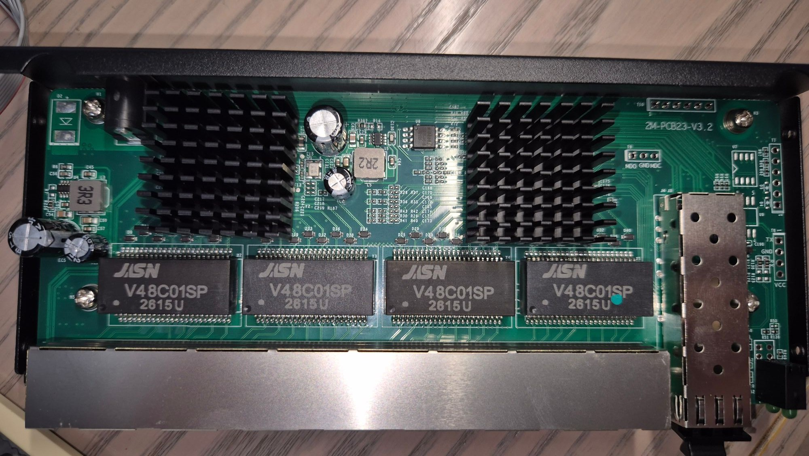

### 2M-PCB23-V3.2

## Brands
|Brand|Type|Managed|PCB|Flash|Chip RTL|
|---|---|---|---|---|---|
| keepLINK | KP-9000-9XHML-X | Yes|  2M-PCB23-V3.2 | 2M (Winbond 25Q) | |

The original web interface reports this board as hardware version V3.2
(original firmware V100.9.25, January 2026).

## PCB

## Compared to V3.1

The component placement matches [2M-PCB23-V3.1](2M-PCB23-V3_1.md): same
positions for the flash (U8), the T7/T8/T9/T10 headers, the SFP cage and its
LED, and the unpopulated U7/U9 footprints. Build with
`MACHINE=KP_9000_9XHML_X_V3_2`, which uses the V3.1 machine definition and
only differs in the reported name.

## Tested

Installed from the original firmware through its web interface with
`installer/output/rtlplayground_oem_upgrade.bin`, then:

- RJ45 ports link at 2.5G; LEDs: orange at 2.5G, green below
- SFP port: module detected with vendor/model/serial and DOM readings
  (temperature, Vcc, TX bias, TX/RX power), link up at 10G
- factory MAC read from flash (0x1FC000)
- reset button (GPIO48): held for more than 10 s it restores the default config

## Flash access

Reading the flash in-circuit with a SOIC-8 clip did not work: the chip ID
comes back as `EF FF FF` (only the manufacturer byte is right) and reads
return 0xff, the same as on a V3.1 board. The switch chip is powered through
the clip and keeps driving the SPI lines. Make sure a way back is acceptable
before installing, or hold the switch chip in reset while reading.
