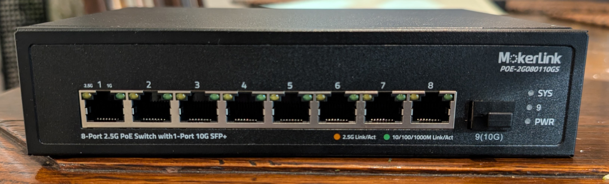
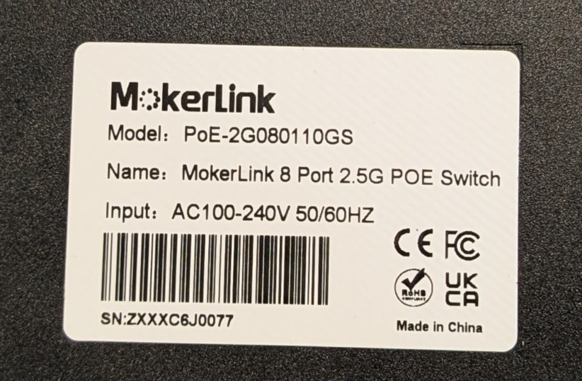
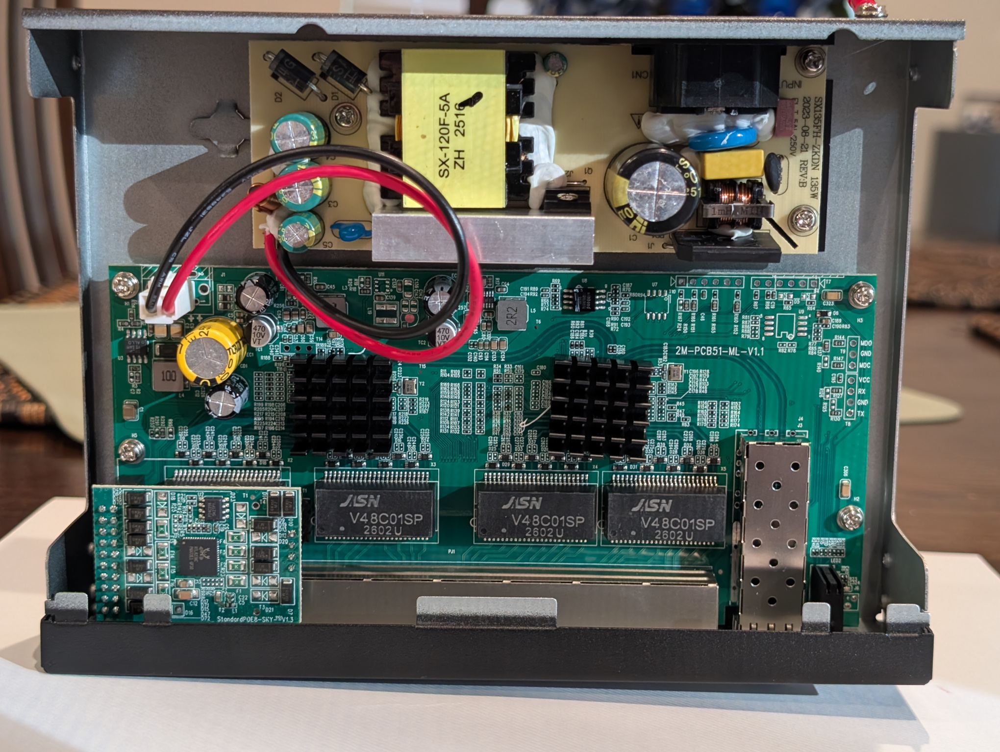

# MokerLink POE-2G080110GS

The `POE-2G080110GS` is an unmanaged 8x2.5G RJ45 and 1xSFP+ PoE switch sold by Mokerlink. There is also a `POE-2G080110GSM` managed version of the switch which may be similar but this has not been verified on actual hardware.

## Brands
| Brand  | Type             |Managed| PCB              | Flash           | Chip RTL      |
|--------|------------------|-------|------------------|-----------------|---------------|
| Mokerlink | POE-2G080110GS | No | 2M-PCB51-ML-V1.1 | 4MB (W25Q32JV) | 8373N + 8224N |

## Hardware overview
Front

Label

The stock firmware from a POE-2G080110GS device had a sha256sum of `4c280853465eaad80e1772075c0f2d29c11fb8c561547f06353d3a5443c388e9`.

### PCB

Top silkscreen is marked `2M-PCB51-ML-V1.1`. PoE is provided by RTL8238C. Flash chip is 4 MB Winbond 25Q32JV (U8).

> [!CAUTION]
> This device operates on mains voltage, which can be a dangerous or potentially lethal hazard. Even after the device is unplugged, high-voltage capacitors can remain charged afterward and may still shock you. Do not attempt to open/disassemble a mains powered device unless you understand how to do so safely. Also, opening the device may void your warranty.

## Notes

The stock firmware blinks both the 2.5G and 1G LEDs on activity, despite the front of the device indicating that each LED should be independent. The `POE_2G080110GS` machine config behaves as the front of the device indicates (and what seems more logical) -- each port LED turns on and blinks independently.
