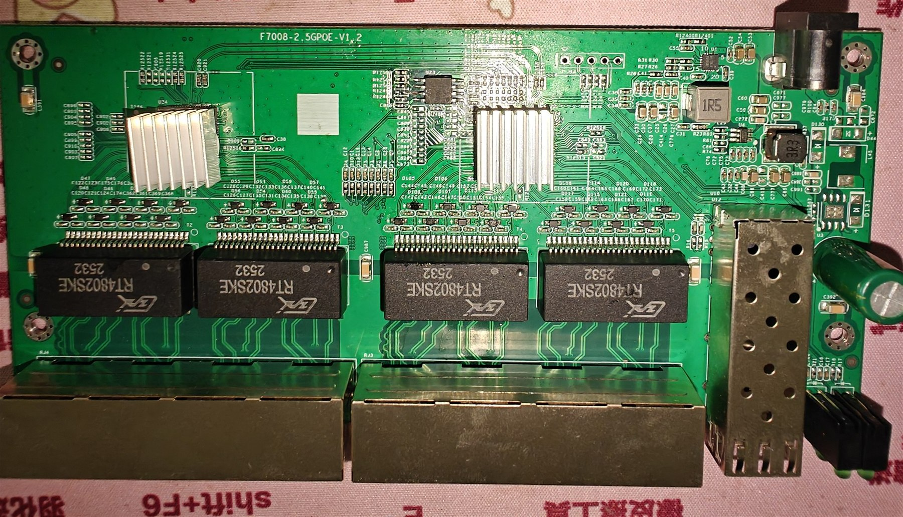
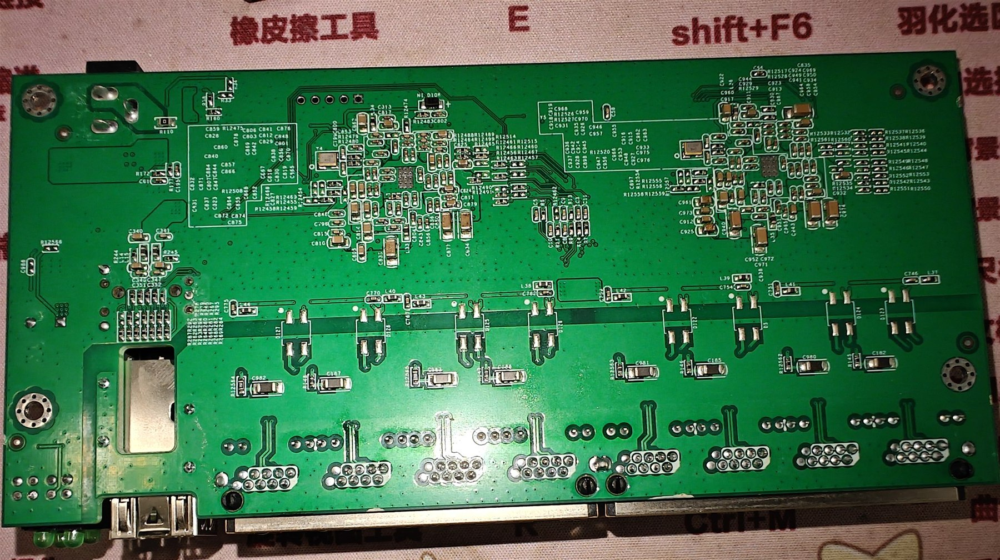

# F7008-2.5

Documentation for the unmanaged 8 + 1 switch sold as `7018-2.5G` by Guangnianwei
(光年微), board marking `F7008-2.5`, PCB `F7008-2.5GPOE-V1.2`.

### Brands

| Brand | Type | Managed | PCB | Flash | Chip RTL |
|-------|------|---------|-----|-------|----------|
| Guangnianwei (光年微) | 7018-2.5G | No | F7008-2.5GPOE-V1.2 | W25Q64JVSSIQ | 8373N + 8224N |

### What works

- All eight 2.5GBASE-T RJ45 ports at 10/100/1000/2500 Mbps
- SFP+ port with 1G/2.5G/10G modules
- LEDs of the eight RJ45 ports

### Not verified

- The LED pads for the SFP+ cage are not mapped yet. The SFP+ lamps are left
  undriven, so an inserted module lights nothing.
- The UART header footprint is present but unpopulated, and no boot log could be
  captured from it, so the baud rate is unknown. There are most likely
  unpopulated 0-Ohm resistors next to the header; bridging those should bring
  the console to life.

### Build target

```
make MACHINE=F7008_2_5
```

### LED wiring

Measured pad to lamp map (`led_mux` index -> lamp):

| Port | green lamp | yellow lamp |
|------|-----------|-------------|
| 1 | pad 0  | pad 1  |
| 2 | pad 2  | pad 3  |
| 3 | pad 4  | pad 5  |
| 4 | pad 6  | pad 8  |
| 5 | pad 9  | pad 10 |
| 6 | pad 12 | pad 15 |
| 7 | pad 18 | pad 21 |
| 8 | pad 24 | pad 25 |

Pads 7, 11, 13, 14, 16, 17, 19, 20, 22, 23, 26 and 27 do not drive an RJ45 lamp.

The front panel is silkscreened `2.5G: Green / 10/100M: Yellow`, and the target
follows it: the green lamp is on while the port is linked at 2.5G, the yellow
lamp blinks while data is flowing.

### PCB overview

The board is marked `F7008-2.5GPOE-V1.2`.

Top side:



Bottom side:



### Hardware notes

- 4 x `RT4802SNE` magnetics
- Unpopulated UART header footprint, next to the magnetics
- Power input 12V 1A, 180 x 84 x 29 mm metal case
