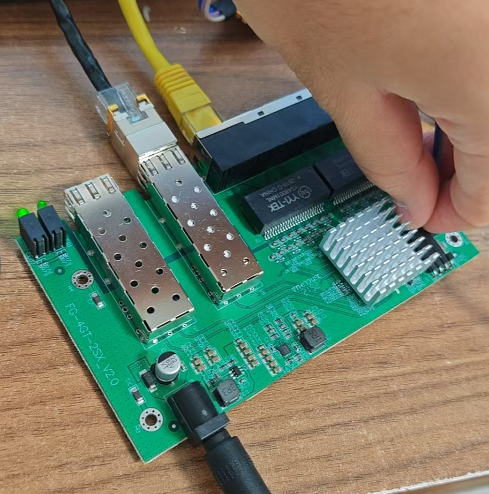
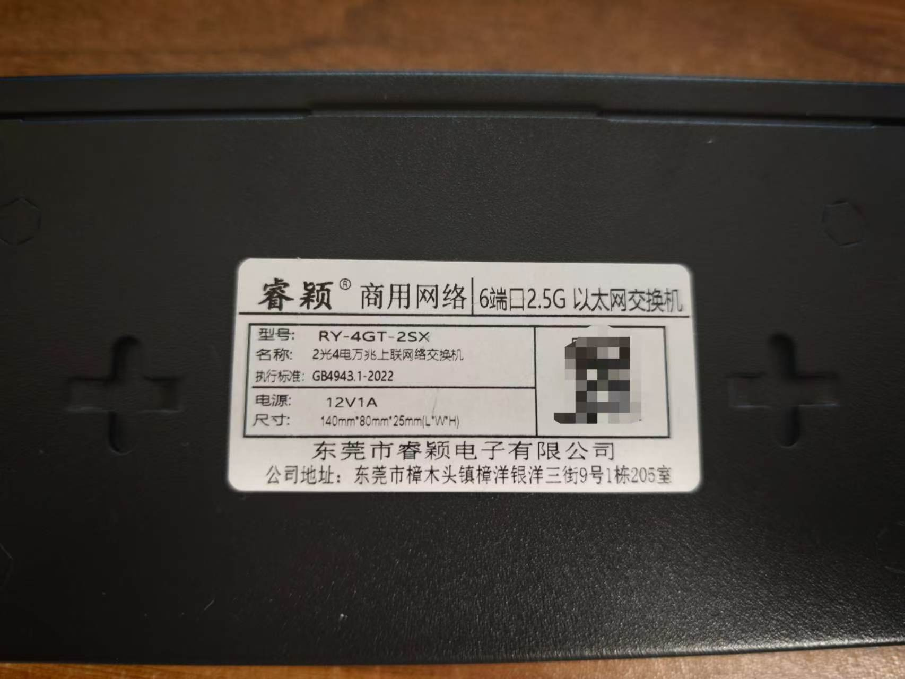
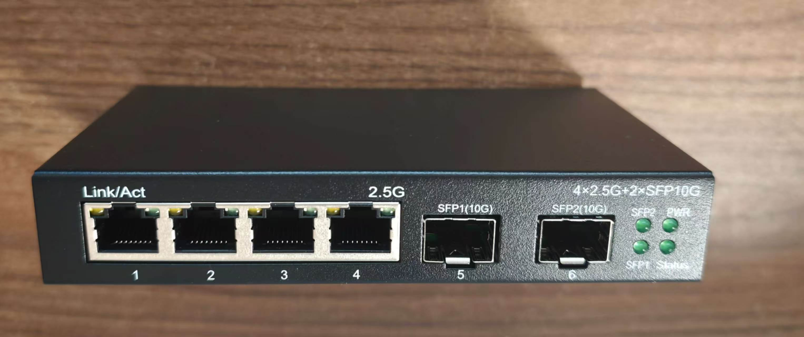
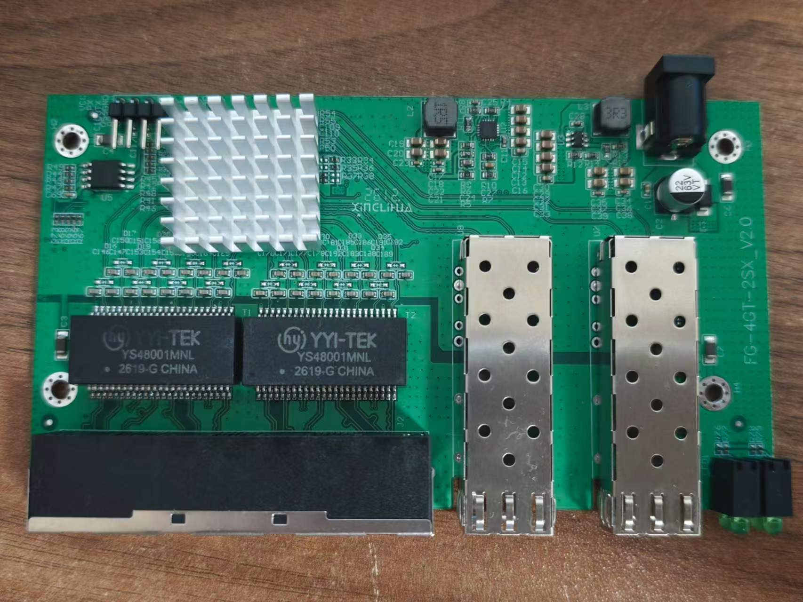
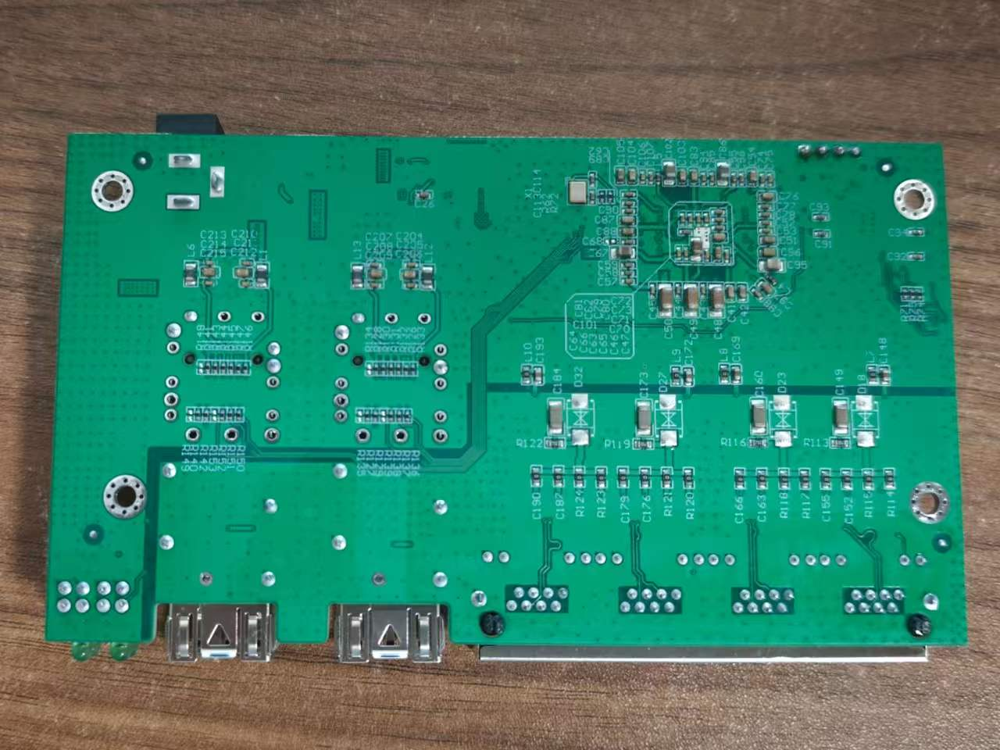

# FG-4GT-2SX_V2.0

Following is documentation for unmanaged switch marked as `FG-4GT-2SX_V2.0`.

Original software is running UART on 9600 baud rate.

The signal quality of UART is bad. Therefore, electrical isolation is needed for the TTL wires in some cases. A simple way to isolate them is to pinch them by fingers.

## Brands

* Ruiying RY-4GT-2SX

## What works

- All four 2.5GBASE-T RJ45 ports at 10/100/1000/2500 Mbps  
- Both SFP ports supporting 1G, 2.5G and 10G modules 
- LEDs

## PCB overview

**Board markings**  

- Top silkscreen: FG-4GT-2SX_V2.0

Front panel

Top side

Bottom

## Power supply

Input power is delivered via barell plug, `12V 1A` adapter was provided.
