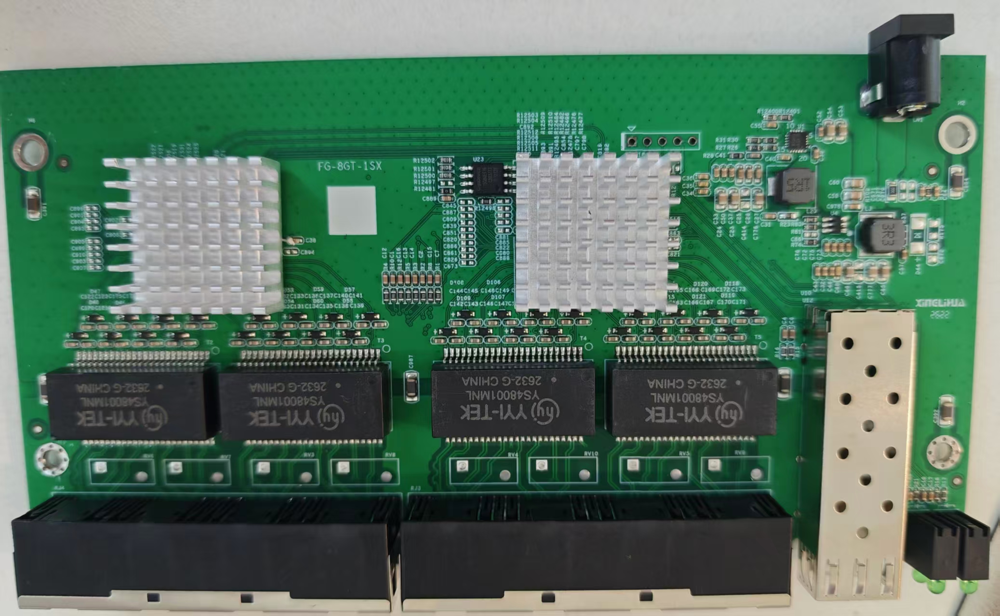
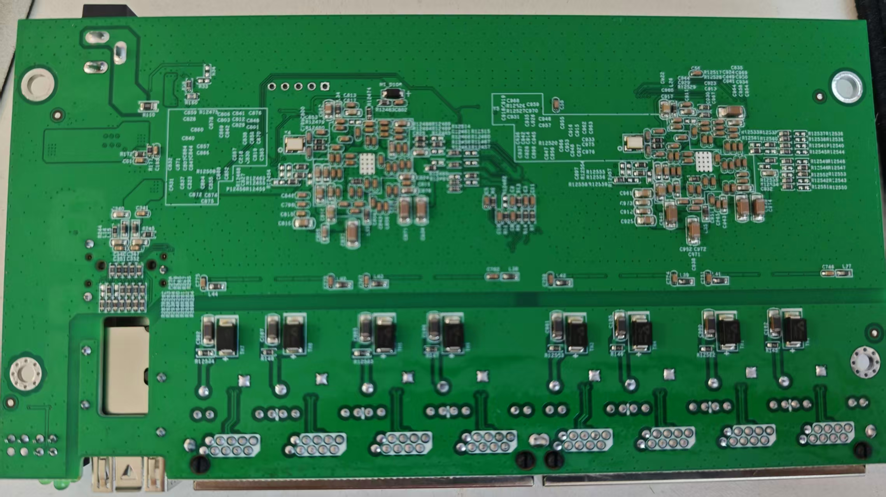
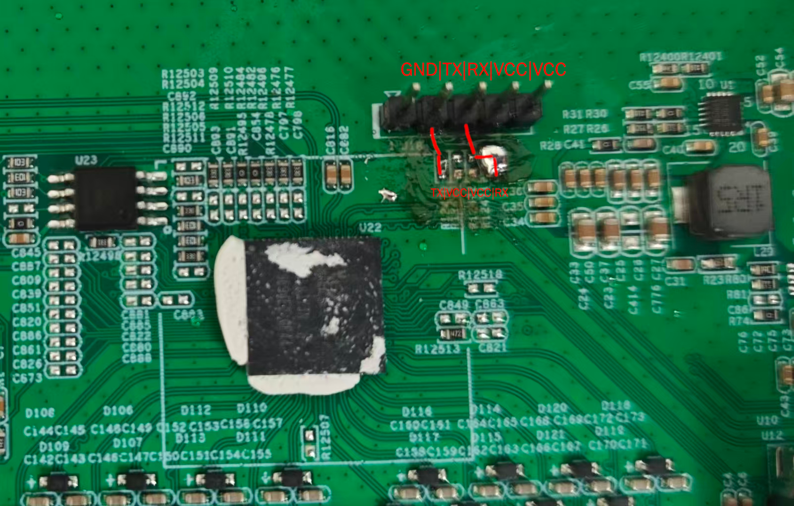

# FG-8GT-1SX

Following is documentation for unmanaged switch marked as `FG-8GT-1SX`.

Original software is running UART on 9600 baud rate.

Using SPI clamp in-board is the only method for initial installation.

### Brands

| Brand   | Type       | Managed | PCB        | Flash       | Chip RTL      |
|---------|------------|---------|------------|-------------|---------------|
| Ruiying | RY-8GT-1SX | No      | FG-8GT-1SX | GD25Q80ESIG | 8373N + 8224N |

### What works

- All eight 2.5GBASE-T RJ45 ports at 10/100/1000/2500 Mbps
- SFP port with 1G/2.5G/10G modules
- LEDs

### PCB overview

**Board markings**

- Top silkscreen: FG-8GT-1SX

Top side:

Bottom:

### Serial console

The PCB has five unpopulated through-holes near the SoC, with a white rectangle surrouding them, labeled as `J18` and a triangle points to the square shaped first pin.

This is where the "expected" UART header should be soldered at, with redundant 3V3 VCC, but also with missing 0Ω resistors between TX/RX and SoC, so simply soldering a header would not work. One need also add the missing resistors or solder the pads together, while making sure not connecting unrelated pads.

Numbered from the triangle, the header pinout is:

| Position | Signal | GPIO   | Status      |
|----------|--------|--------|-------------|
| 1        | GND    | GND    | Internal    |
| 2        | TX     | GPIO31 | Unconnected |
| 3        | RX     | GPIO32 | Unconnected |
| 4        | 3V3    | -      | Internal    |
| 5        | 3V3    | -      | Internal    |

There're four resistor pads near the header.

| Resistor ID | SoC Side    | Header Side |
|-------------|-------------|-------------|
| R1240       | TX / GPIO31 | Pin 2       |
| R1243       | 3V3         | -           |
| R1242       | 3V3         | Pin 3       |
| R1241       | RX / GPIO32 | -           |

To get TX working, solder a 0Ω resistor between the pads for R1240 or solder them together.

For RX However, the designer certainly made a mistake, as the SoC-side lines to the resistor expected for Rx (R1242) and 3V3 (R1241) are swapped. For RX to work, the R1241 SoC side and R1242 header side shall be connected, so either:

- Solder: R1241 SoC side -> R1241 header side -> R1242 header side
- Jump wire: R1241 SoC side -> R1242 header side

Be sure not to bring R1242 SoC side to the connection as that would wire Rx to 3v3.

A complete working serial header should look like following on this PCB:

- **Settings**: 115200 baud / 8N1 / 3.3V TTL
- Connect a USB-TTL adapter: adapter GND → pin 1, RX → pin 2, TX → pin 3

### Power supply

Input power is delivered via barell plug, `12V 1A` adapter was provided.

