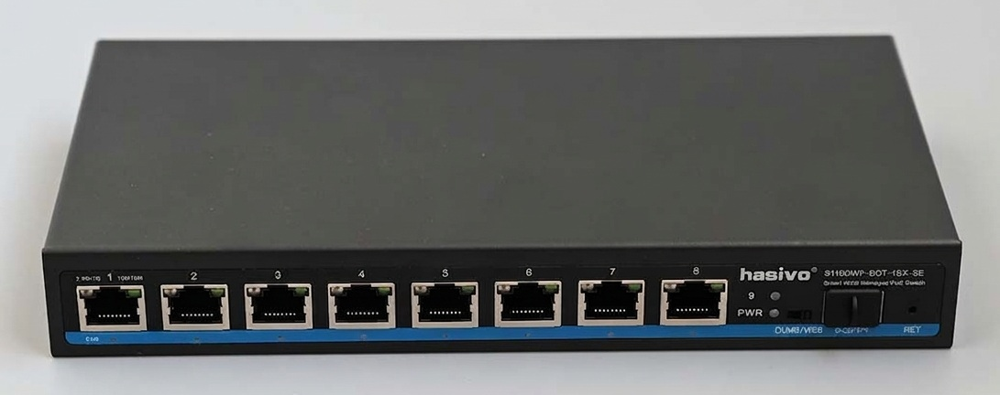
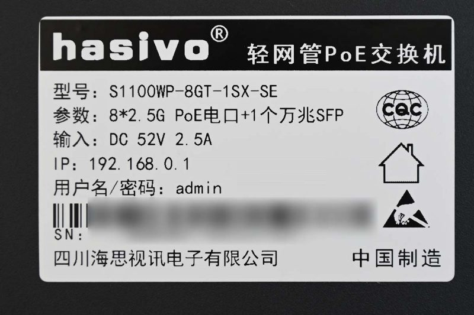
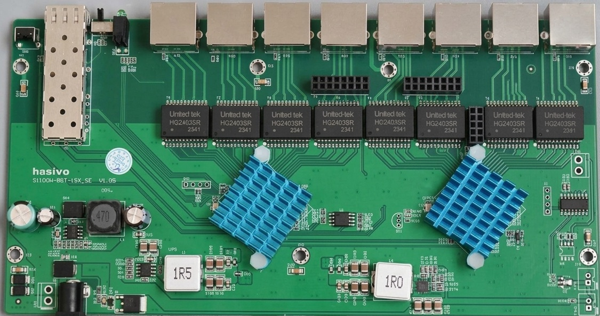
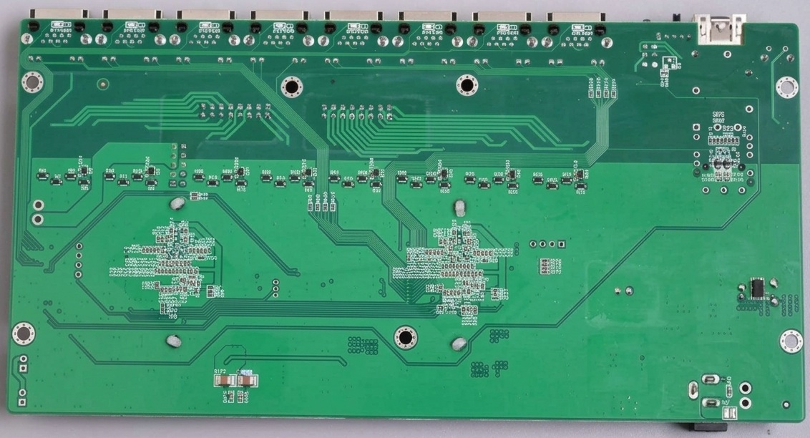

# Hasivo S1100WP-8GT-1SX-SE

RTL8373-based 8×2.5G PoE + 1×SFP switch.

### Label specifications

- **Manufacturer**: Hasivo
- **Model**: S1100WP-8GT-1SX-SE
- **Ports**:
  - 8 × RJ45: 10/100/1000/2500 Mbps with PoE
  - 1 × SFP: 1G / 2.5G / 10G
- **Power input**: DC 52V 2.5A
- **Stock firmware defaults**: IP 192.168.0.1, user/password `admin`/`admin`

### What works

- All eight 2.5GBASE-T RJ45 ports at 10/100/1000/2500 Mbps (PoE is not configurable via RTLPlayground)
- SFP port supporting 1G, 2.5G and 10G modules
- LEDs: green (2.5G) and amber (1G/100M/10M) per copper port; combined link/act on the SFP port

### Photos

Front panel:

Label:

### PCB overview

Top side:

Bottom side:

### Port layout

| Logical port | Physical port | Type   |
|--------------|---------------|--------|
| 1-8          | 1-8           | Copper |
| 9            | 9             | SFP    |

### LED configuration

Copper ports use LED SET0, the SFP port uses LED SET1.

| SET  | LED0                                          | LED2                                                 |
|------|-----------------------------------------------|------------------------------------------------------|
| SET0 | Green — lights on 2.5G link with activity     | Amber — lights on 1G / 100M / 10M link with activity |
| SET1 | All speeds — lights on any link with activity | —                                                    |

### SFP GPIO assignments

| SFP (logical 9) | pin_detect (ModAbs) | pin_los | pin_tx_disable | SerDes | I2C SDA         | I2C SCL             |
|-----------------|---------------------|---------|----------------|--------|-----------------|---------------------|
| SFP             | GPIO30_ACL_BIT3_EN  | GPIO37  | GPIO_NA        | SDS1   | GPIO39_I2C_SDA4 | GPIO40_I2C_SCL3_MDC1 |

### Machine configuration

- `reset_pin`: GPIO54_ACL_BIT2_EN
- High LEDs (pads 27-29): mux = `LED_27 | LED_28_SYS | LED_29`, enable = `LED_28_SYS | LED_29`

### PoE

The 8 copper ports support PoE powered by a DC 52V 2.5A input. Power management is handled by two HS104PTI chipsets over I2C (GPIO47_I2C_SDA0, GPIO46_I2C_SCL0):

* Chip 1 (I2C address 0x1A): 2.5G Ports 1–4
* Chip 2 (I2C address 0x2A): 2.5G Ports 5–8

Note: The current implementation does not yet support PoE management. Consequently, PoE currently operates in standalone mode without software control.