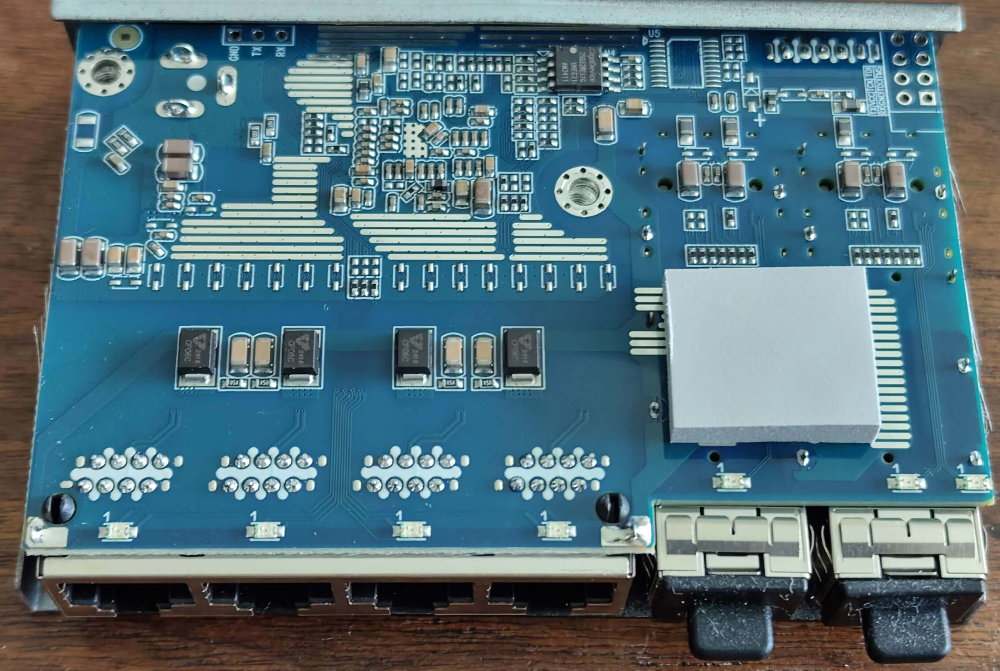
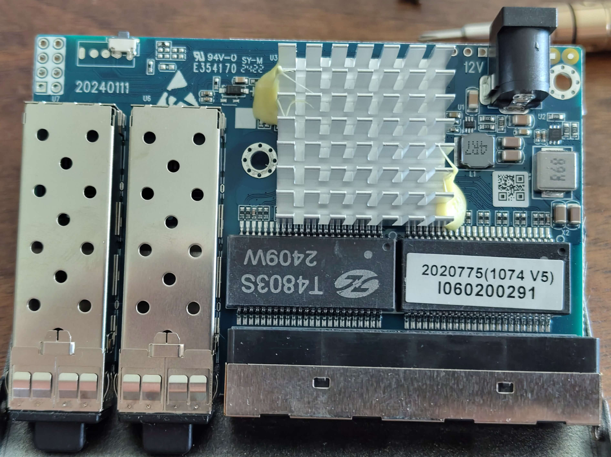
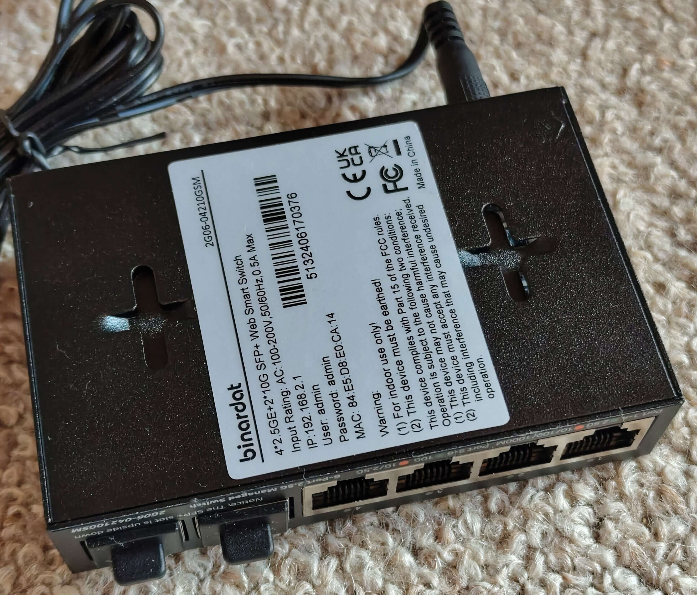

# ONT-S207CW-62TS-SE / Binardat 2G06-04210GSM / Binardat 2G06-04210GS

## Overview

ONT-S207CW-62TS-SE, Binardat 2G06-04210GSM (managed), and Binardat 2G06-04210GS (unmanaged) are **switches with identical hardware**:
- **CPU:** RTL8372N (confirmed via serial: "Detecting CPU: RTL8372N")
- **Flash:** GD25Q128E (16MB)
- **Ports:** 4x 2.5G RJ45 + 2x 10G SFP+
- **Console:** 115200 baud (RTLPlayground firmware) / 9600 baud (stock firmware)

**Note:** These devices are **RTL8372N-based** with **LAN ports mounted upside-down on the PCB**, requiring a custom configuration. The `MACHINE_ONT_S207CW_62TS_SE` definition uses a **custom configuration** with:
- Corrected port mapping (physical ports 1-4 = RJ45, 5-6 = SFP)
- Optimized LED sets for different port wiring (RJ45 Ports 1-2 have reversed LED wiring)
- Custom LED mux configuration

## Device Photos

### Binardat 2G06-04210GSM

**Front View:**


**Back View:**


**PCB View:**


*Photos courtesy of [andreas5232](https://github.com/andreas5232) from [emesix/ONT-S207CW-62TS-SE#1](https://github.com/emesix/ONT-S207CW-62TS-SE/issues/1)*

## Hardware Specification

| Feature | Value |
|---|---|
| **CPU** | RTL8372N |
| **Flash** | GD25Q128E (16MB) |
| **RAM** | Integrated in RTL8372N |
| **RJ45 Ports** | 4x 2.5GBase-T (Ports 1-4) |
| **SFP+ Ports** | 2x 10G (Ports 5-6) |
| **Console** | UART (115200 baud for RTLPlayground, 9600 baud for stock) |
| **Stock Web UI IP** | 192.168.2.1 |
| **Loader Mode IP** | 192.168.10.247 |

## Port Layout

```
┌─────────────────────────────────────────────┐
│  ┌─────┐ ┌─────┐ ┌─────┐ ┌─────┐   ┌─────┐ ┌─────┐  │
│  │RJ45 │ │RJ45 │ │RJ45 │ │RJ45 │   │SFP+ │ │SFP+ │  │
│  │  1  │ │  2  │ │  3  │ │  4  │   │  5  │ │  6  │  │
│  └─────┘ └─────┘ └─────┘ └─────┘   └─────┘ └─────┘  │
│                                                     │
│  [System LEDs]                                      │
└─────────────────────────────────────────────┘
```

## LED Behavior

### RJ45 Ports (Physical 1-4)

| LED Color | Speed |
|---|---|
| **Green** | 2.5G |
| **Orange** | 1G / 100M / 10M |
| **Off** | No link |

### SFP+ Ports (Physical 5-6)

| LED Color | Speed |
|---|---|
| **Green** | 10G |
| **Orange** | 2.5G / 1G |
| **Off** | No link / No SFP module |

## Port to Logical Mapping

Custom mapping for ONT-S207CW-62TS-SE:

| Physical Port | Logical Port | Type | LED Set |
|---|---|---|---|
| 1 | 7 | RJ45 | 2 |
| 2 | 6 | RJ45 | 2 |
| 3 | 5 | RJ45 | 0 |
| 4 | 4 | RJ45 | 0 |
| 5 | 3 | SFP+ (SDS0) | 3 |
| 6 | 8 | SFP+ (SDS1) | 3 |

**Note:** Ports 1-2 (RJ45) have reversed LED wiring and use LED-Set 2. SFP Ports 5-6 use LED-Set 3 to account for wiring differences.

## Flashing Instructions

See the [README.md](../../README.md) for general flashing instructions.

## Stock Firmware Information

| Property | Value |
|---|---|
| **Default IP** | 192.168.2.1 (ONT) / 192.168.10.247 (Loader Mode) |
| **Default Login** | admin/admin (may vary by OEM) |
| **Console Baud** | 9600 (stock) / 115200 (RTLPlayground) |
| **CPU String** | "RTL8372N" |
| **Loader Mode IP** | 192.168.10.247 |

## Configuration Details

- **CPU:** RTL8372N
- **SFP:** SDS0 on logical port 3 (GPIO37), SDS1 on logical port 8 (GPIO38)
- **Port Mapping:** Physical 1-4 → Logical 7-4, Physical 5-6 → Logical 3,8
- **LED Wiring:** RJ45 Ports 1-2 and SFP Port 6 have reversed LED pins (orange/green swapped)
- **LED Sets:** Set 0 for RJ45 Ports 3-4, Set 1 unused, Set 2 for RJ45 Ports 1-2, Set 3 for SFP Ports 5-6

## Notes

- ONT-S207CW-62TS-SE, Binardat 2G06-04210GSM (managed), and Binardat 2G06-04210GS (unmanaged) are **RTL8372N-based** with **LAN ports mounted upside-down on the PCB**
- Web UI shows correct physical port order (1-2-3-4 for RJ45, 5-6 for SFP)
- Loader Mode always remains accessible at `192.168.10.247` for recovery
- Serial console: 9600 baud (stock) → 115200 baud (RTLPlayground)

## References

- [GitHub Issue: emesix/ONT-S207CW-62TS-SE#1](https://github.com/emesix/ONT-S207CW-62TS-SE/issues/1) - Original photos and discussion
- [PR: logicog/RTLPlayground#465](https://github.com/logicog/RTLPlayground/pull/465) - Feedback and improvements
