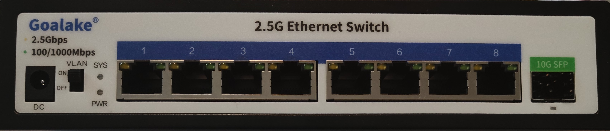
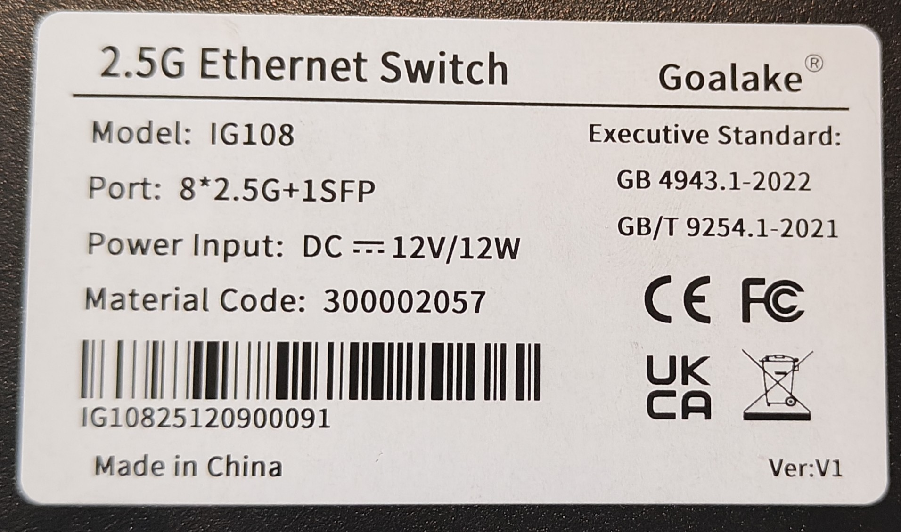
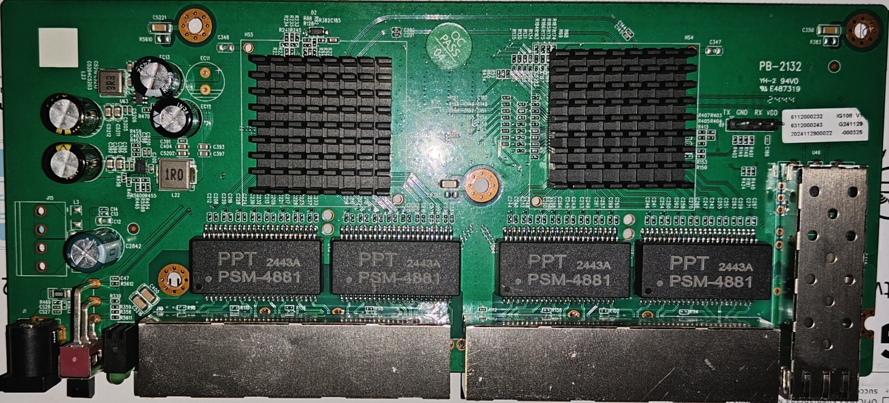
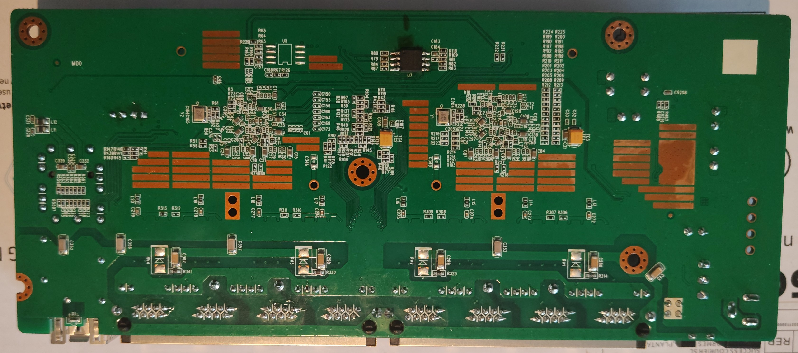

# IG108

Following is documentation for unmanaged switch marked as `IG108`.

Original software is running UART on 9600 baud rate.

Using SPI clamp in-board is the only method for initial installation.

### Brands

| Brand   | Type       | Managed | PCB        | Flash       | Chip RTL      |
|---------|------------|---------|------------|-------------|---------------|
| Goalake | IG108      | No      | PB-2132    | cFeon Q32A  | 8373N + 8224N |
| Netcore | GS9        | No      | PB-2132    | cFeon Q32A  | 8373N + 8224N |

### What works

- All eight 2.5GBASE-T RJ45 ports at 10/100/1000/2500 Mbps
- SFP port with 1G/2.5G/10G modules
- LEDs

### PCB overview

**Board markings**

- Top silkscreen: PB-2132

Front Goalake:

Label Goalake: 

Top side:

Bottom:

### Serial console

The PCB has unpopulated through-holes near the SFP Port, with description of each pin, works out of the box.

- **Settings**: 115200 baud / 8N1 / 3.3V TTL

### Power supply

Input power is delivered via barell plug, `12V 1A` adapter was provided.

