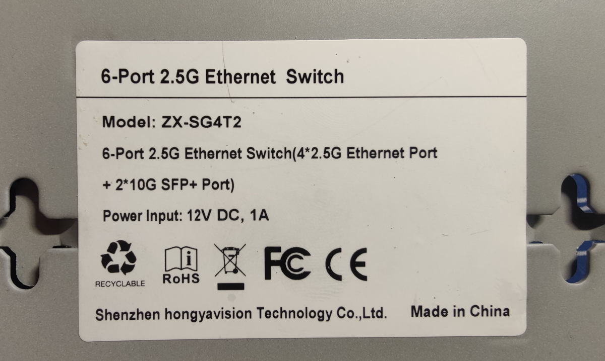
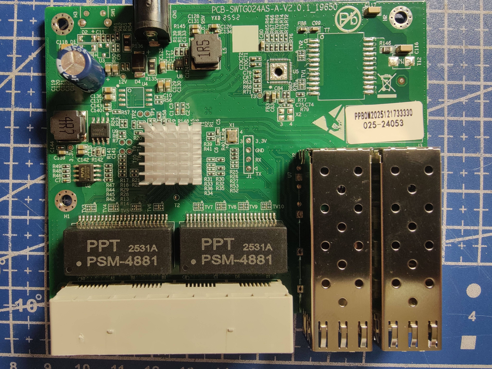
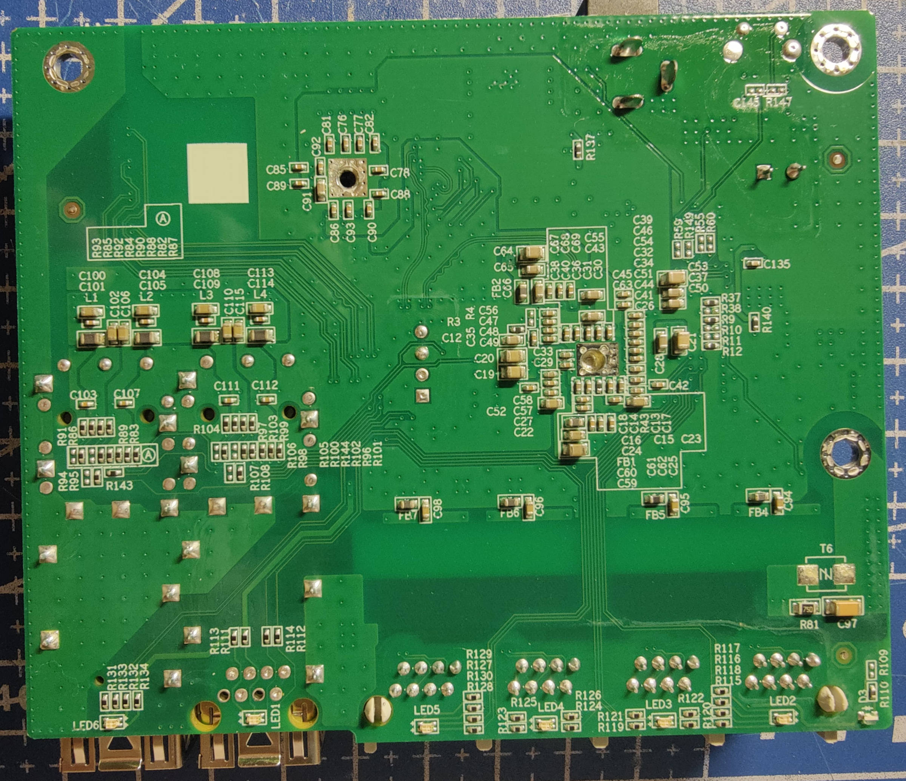

### SWTG024AS-A-V2.0.1_4C_2SFP
It is highly similar to SWTG024AS-V2.0, with the only difference being the GPIO configuration for the SFP port.

## Brands
|Brand|Type|Managed|PCB|Flash|Chip RTL|
|---|---|---|---|---|---|
| Horaco | ZX-SG4T2 |  | PCB-SWTG024AS-A-V2.0.1_19650 | P25D40SH | ??? |

### Label specifications

- **Name**: 
- **Ports**:
  - 4 × RJ45: 10/100/1000/2500 Mbps
  - 2 × SFP+: 1000 / 2500 / 10000 Mbps

### What works
The device is fully supported:
- ALL 2.5GBASE-T RJ45 ports work at 10/100/1000/2500 Mbps
- The SFP+ port supports 1G, 2.5G and 10G modules 

### PCB overview

**Board markings**
- Top silkscreen: PCB-SWTG024AS-A-V2.0.1_19650

Top side

Bottom

### J1, serial console

| `J1` pin | Signal      |
| -------- | ----------- |
| 1        | 3V3         |
| 2        | GND         |
| 3        | RX (Input)  |
| 4        | TX (Output) |
